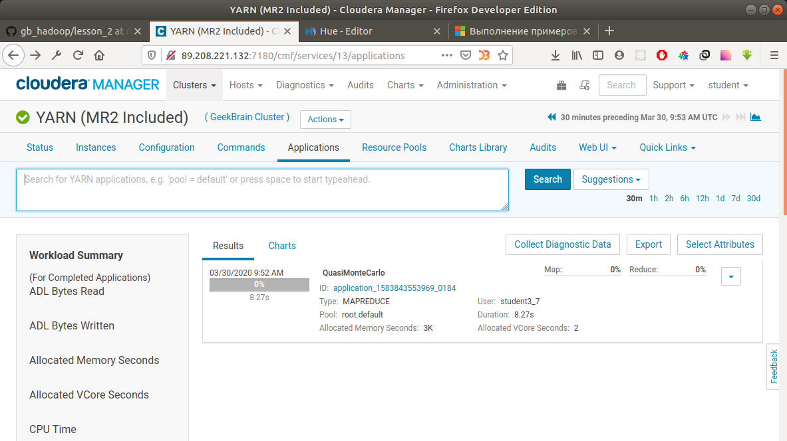
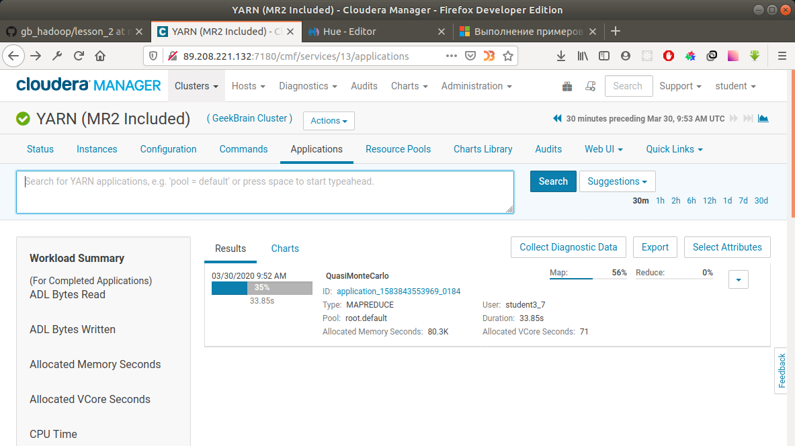
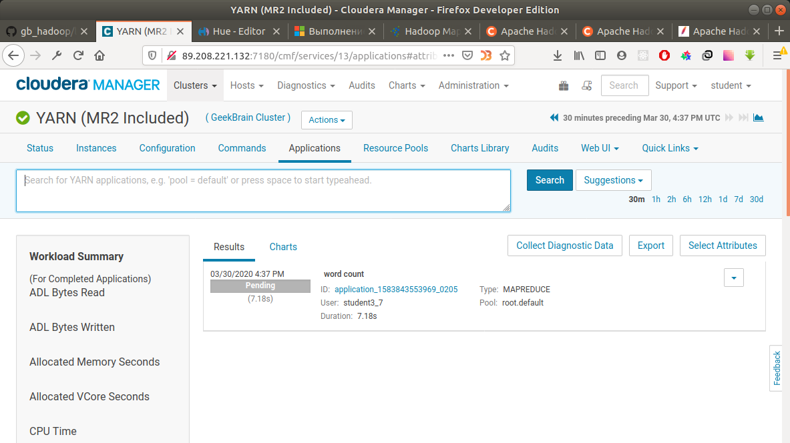
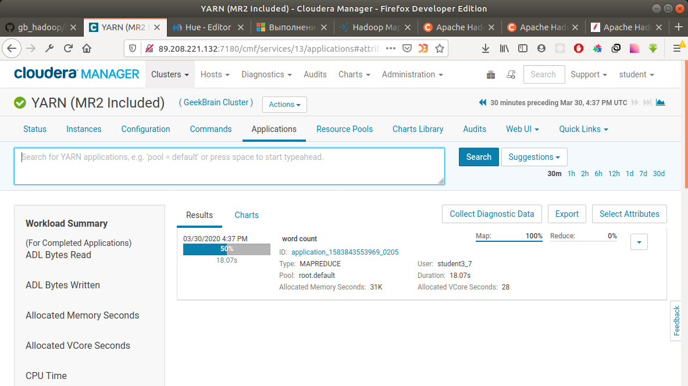
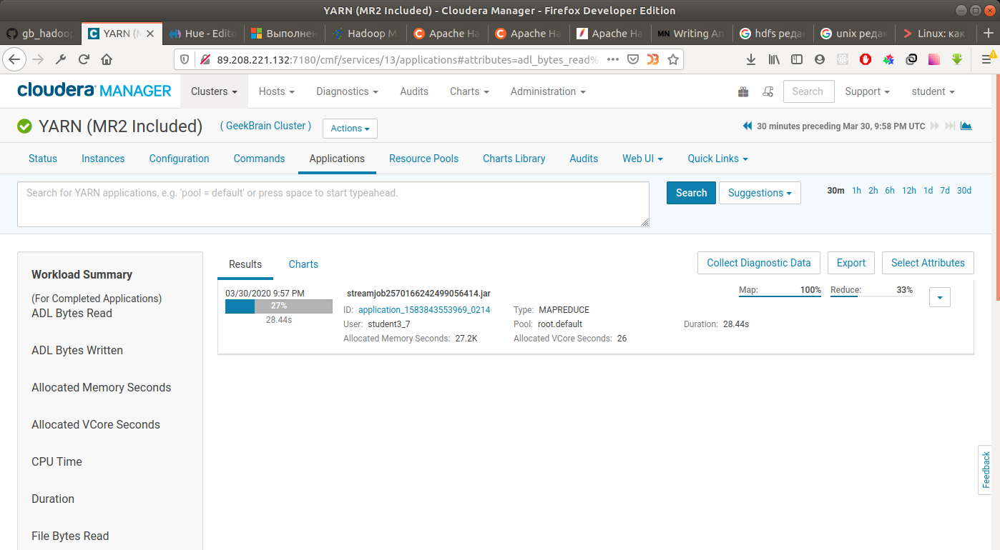

## Урок 2.YARN. Парадигма Map Reduce.

**0. [Исследовательское задание]\[от прошлого потока\] Найти каким образом получить доступ к HDFS как суперпользователь hdfs, не испорльзуя утилиту sudo. Достаточно написать как это сделать одной строкой и задание будет считаться выполненным.**

```
[student3_7@manager ~]$ export HADOOP_USER_NAME=hdfs
[student3_7@manager ~]$ hdfs dfs -touchz /student3_7/test
[student3_7@manager ~]$ hdfs dfs -ls /student3_7/
Found 2 items
-rw-r--r--   3 hdfs       supergroup          0 2020-03-30 20:19 /student3_7/test
-rw-r--r--   3 student3_7 supergroup          0 2020-03-30 20:21 /student3_7/test_general
```

Файл `test_general` был создан под учеткой `student3_7`. Вроде похоже на то, что файл `test` создан под пользователем `hdfs`.

**0. [Исследовательское задание] Сколько узлов можно потерять в кластере из 10 узлов без потери данных? Из 100 узлов?**

С обычным фактором репликации 3, один файл будет храниться на трёх разных узлах. Поэтому потеря трёх любых узлов может привести к потере данных. Но не обязательно. Должны выйти из строя именно те три узла, на которых реплецирован один и тот же блок. Это же верно и для кластера из 100 узлов. Т.е. для гарантированного сохранения данных допустИм выход из строя только двух узлов в кластерах из 10 или 100 узлов.

Если кластер настроен на распределение загрузки узлов и в базе хранится моного файлов, то выход любых трёх узлов почти гарантированно приведёт к потере данных. Три блока по десяти узлам можно распределить  способами. Среди миллионов блоков, хранящихся в базе, наверняка наёдутся три одинаковых, которые хранятся на трёх вышедших из строя узлах. В случае с кластером из 100 узов, три блока можно распределить по 100 узлам  способами. Блоков в этом кластере будет в 10 раз больше, но способов компановки трёх блоков по 100 узлам в 1347,5 раз больше. Т.е. можно сделать вывод, что кластер из 100 узлов в 134,75 раз надёжнее чем кластер из 10 узлов. Но всё-таки число комбинаций трёх блоков по 100 узлам существенно меньше общего числа блоков в базе. Поэтому и в этом случае выход 3-х узлов гарантирует потерю данных.

При отсутствии балансировки по памяти, только выход 8 и 98 узлов соответственно, гарантированно приведёт к потере данных.

https://latex.codecogs.com/gif.download?%5Cinline%20C_%7B100%7D%5E3%20%3D%20%5Cfrac%7B100%21%7D%7B97%21%20%5Ccdot%203%21%7D%20%3D%20161700

https://latex.codecogs.com/gif.download?%5Cinline%20C_%7B10%7D%5E3%20%3D%20%5Cfrac%7B10%21%7D%7B7%21%20%5Ccdot%203%21%7D%20%3D%20120

$C_{10}^3 = \frac{10!}{7! \cdot 3!} = 120$

$C_{100}^3 = \frac{100!}{97! \cdot 3!} = 161700$

**1-5. Опробовать запуски map-reduce задач для кластера используя hadoop-mapreduce-examples.jar. Выполнить три любых задачи включенных в этот JAR. Найти свои задачи в интерфейсе Cloudera Manager. Опробовать навигацию по интерфейсу YARN. Сделать документ со скриншотами того, что вы видели.**

Найдём место расположения файла jar-файла с тестовыми примерами.

```
[student3_7@manager ~]$ find /opt -name "hadoop-mapreduce-examples.jar"
/opt/cloudera/parcels/CDH-5.16.2-1.cdh5.16.2.p0.8/lib/hadoop-mapreduce/hadoop-mapreduce-examples.jar
[student3_7@manager ~]$ export YARN_EXAMPLES=/opt/cloudera/parcels/CDH-5.16.2-1.cdh5.16.2.p0.8/lib/hadoop-mapreduce
```

Запустим первый пример для расчёта числа Пи.

```
[student3_7@manager ~]$ yarn jar $YARN_EXAMPLES/hadoop-mapreduce-examples.jar pi 16 1000000
```

<details>
  <summary>Результат вывода в консоль</summary>

```
Number of Maps  = 16
Samples per Map = 1000000
Wrote input for Map #0
Wrote input for Map #1
Wrote input for Map #2
Wrote input for Map #3
Wrote input for Map #4
Wrote input for Map #5
Wrote input for Map #6
Wrote input for Map #7
Wrote input for Map #8
Wrote input for Map #9
Wrote input for Map #10
Wrote input for Map #11
Wrote input for Map #12
Wrote input for Map #13
Wrote input for Map #14
Wrote input for Map #15
Starting Job
20/03/30 09:52:54 INFO client.RMProxy: Connecting to ResourceManager at manager.novalocal/89.208.221.132:8032
20/03/30 09:52:54 INFO input.FileInputFormat: Total input paths to process : 16
20/03/30 09:52:54 INFO mapreduce.JobSubmitter: number of splits:16
20/03/30 09:52:55 INFO mapreduce.JobSubmitter: Submitting tokens for job: job_1583843553969_0184
20/03/30 09:52:55 INFO impl.YarnClientImpl: Submitted application application_1583843553969_0184
20/03/30 09:52:55 INFO mapreduce.Job: The url to track the job: http://manager.novalocal:8088/proxy/application_1583843553969_0184/
20/03/30 09:52:55 INFO mapreduce.Job: Running job: job_1583843553969_0184
20/03/30 09:53:02 INFO mapreduce.Job: Job job_1583843553969_0184 running in uber mode : false
20/03/30 09:53:02 INFO mapreduce.Job:  map 0% reduce 0%
20/03/30 09:53:07 INFO mapreduce.Job:  map 13% reduce 0%
20/03/30 09:53:10 INFO mapreduce.Job:  map 19% reduce 0%
20/03/30 09:53:11 INFO mapreduce.Job:  map 25% reduce 0%
20/03/30 09:53:14 INFO mapreduce.Job:  map 31% reduce 0%
20/03/30 09:53:15 INFO mapreduce.Job:  map 38% reduce 0%
20/03/30 09:53:18 INFO mapreduce.Job:  map 44% reduce 0%
20/03/30 09:53:19 INFO mapreduce.Job:  map 50% reduce 0%
20/03/30 09:53:22 INFO mapreduce.Job:  map 56% reduce 0%
20/03/30 09:53:23 INFO mapreduce.Job:  map 63% reduce 0%
20/03/30 09:53:26 INFO mapreduce.Job:  map 69% reduce 0%
20/03/30 09:53:27 INFO mapreduce.Job:  map 75% reduce 0%
20/03/30 09:53:30 INFO mapreduce.Job:  map 81% reduce 0%
20/03/30 09:53:31 INFO mapreduce.Job:  map 88% reduce 0%
20/03/30 09:53:35 INFO mapreduce.Job:  map 94% reduce 0%
20/03/30 09:53:39 INFO mapreduce.Job:  map 100% reduce 0%
20/03/30 09:53:41 INFO mapreduce.Job:  map 100% reduce 100%
20/03/30 09:53:42 INFO mapreduce.Job: Job job_1583843553969_0184 completed successfully
20/03/30 09:53:42 INFO mapreduce.Job: Counters: 49
        File System Counters
                FILE: Number of bytes read=174
                FILE: Number of bytes written=2547624
                FILE: Number of read operations=0
                FILE: Number of large read operations=0
                FILE: Number of write operations=0
                HDFS: Number of bytes read=4454
                HDFS: Number of bytes written=215
                HDFS: Number of read operations=67
                HDFS: Number of large read operations=0
                HDFS: Number of write operations=3
        Job Counters
                Launched map tasks=16
                Launched reduce tasks=1
                Data-local map tasks=16
                Total time spent by all maps in occupied slots (ms)=44140
                Total time spent by all reduces in occupied slots (ms)=7720
                Total time spent by all map tasks (ms)=44140
                Total time spent by all reduce tasks (ms)=7720
                Total vcore-milliseconds taken by all map tasks=44140
                Total vcore-milliseconds taken by all reduce tasks=7720
                Total megabyte-milliseconds taken by all map tasks=45199360
                Total megabyte-milliseconds taken by all reduce tasks=7905280
        Map-Reduce Framework
                Map input records=16
                Map output records=32
                Map output bytes=288
                Map output materialized bytes=576
                Input split bytes=2566
                Combine input records=0
                Combine output records=0
                Reduce input groups=2
                Reduce shuffle bytes=576
                Reduce input records=32
                Reduce output records=0
                Spilled Records=64
                Shuffled Maps =16
                Failed Shuffles=0
                Merged Map outputs=16
                GC time elapsed (ms)=1016
                CPU time spent (ms)=14040
                Physical memory (bytes) snapshot=7639375872
                Virtual memory (bytes) snapshot=47492177920
                Total committed heap usage (bytes)=7527727104
        Shuffle Errors
                BAD_ID=0
                CONNECTION=0
                IO_ERROR=0
                WRONG_LENGTH=0
                WRONG_MAP=0
                WRONG_REDUCE=0
        File Input Format Counters
                Bytes Read=1888
        File Output Format Counters
                Bytes Written=97
Job Finished in 48.178 seconds
Estimated value of Pi is 3.14159125000000000000
```

</details>

Создалось приложение `application_1583843553969_0184`. В интерфейсе Cloudera Manager наблюдаем выполнение задачи:

<details>
  <summary>Скриншоты интерфейса Cloudera Manager</summary>





</details>

Второй пример с подсчётом слов внутри файла

```
[student3_7@manager ~]$ yarn jar $YARN_EXAMPLES/hadoop-mapreduce-examples.jar wordcount /acldir/etc/nfsmount.conf /tmp/output2
```

<details>
  <summary>Результат вывода в консоль</summary>

```
20/03/30 16:37:23 INFO client.RMProxy: Connecting to ResourceManager at manager.novalocal/89.208.221.132:8032
20/03/30 16:37:24 INFO input.FileInputFormat: Total input paths to process : 1
20/03/30 16:37:24 INFO mapreduce.JobSubmitter: number of splits:1
20/03/30 16:37:25 INFO mapreduce.JobSubmitter: Submitting tokens for job: job_1583843553969_0205
20/03/30 16:37:25 INFO impl.YarnClientImpl: Submitted application application_1583843553969_0205
20/03/30 16:37:25 INFO mapreduce.Job: The url to track the job: http://manager.novalocal:8088/proxy/application_1583843553969_0205/
20/03/30 16:37:25 INFO mapreduce.Job: Running job: job_1583843553969_0205
20/03/30 16:37:30 INFO mapreduce.Job: Job job_1583843553969_0205 running in uber mode : false
20/03/30 16:37:30 INFO mapreduce.Job:  map 0% reduce 0%
20/03/30 16:37:37 INFO mapreduce.Job:  map 100% reduce 0%
20/03/30 16:37:45 INFO mapreduce.Job:  map 100% reduce 33%
20/03/30 16:37:49 INFO mapreduce.Job:  map 100% reduce 50%
20/03/30 16:37:52 INFO mapreduce.Job:  map 100% reduce 67%
20/03/30 16:37:53 INFO mapreduce.Job:  map 100% reduce 83%
20/03/30 16:37:57 INFO mapreduce.Job:  map 100% reduce 100%
20/03/30 16:37:58 INFO mapreduce.Job: Job job_1583843553969_0205 completed successfully
20/03/30 16:37:58 INFO mapreduce.Job: Counters: 49
      File System Counters
              FILE: Number of bytes read=2854
              FILE: Number of bytes written=1051785
              FILE: Number of read operations=0
              FILE: Number of large read operations=0
              FILE: Number of write operations=0
              HDFS: Number of bytes read=3509
              HDFS: Number of bytes written=2277
              HDFS: Number of read operations=21
              HDFS: Number of large read operations=0
              HDFS: Number of write operations=12
      Job Counters
              Launched map tasks=1
              Launched reduce tasks=6
              Data-local map tasks=1
              Total time spent by all maps in occupied slots (ms)=4740
              Total time spent by all reduces in occupied slots (ms)=24974
              Total time spent by all map tasks (ms)=4740
              Total time spent by all reduce tasks (ms)=24974
              Total vcore-milliseconds taken by all map tasks=4740
              Total vcore-milliseconds taken by all reduce tasks=24974
              Total megabyte-milliseconds taken by all map tasks=4853760
              Total megabyte-milliseconds taken by all reduce tasks=25573376
      Map-Reduce Framework
              Map input records=135
              Map output records=593
              Map output bytes=5723
              Map output materialized bytes=2830
              Input split bytes=119
              Combine input records=593
              Combine output records=227
              Reduce input groups=227
              Reduce shuffle bytes=2830
              Reduce input records=227
              Reduce output records=227
              Spilled Records=454
              Shuffled Maps =6
              Failed Shuffles=0
              Merged Map outputs=6
              GC time elapsed (ms)=444
              CPU time spent (ms)=9370
              Physical memory (bytes) snapshot=1779253248
              Virtual memory (bytes) snapshot=19632926720
              Total committed heap usage (bytes)=1572339712
      Shuffle Errors
              BAD_ID=0
              CONNECTION=0
              IO_ERROR=0
              WRONG_LENGTH=0
              WRONG_MAP=0
              WRONG_REDUCE=0
      File Input Format Counters
              Bytes Read=3390
      File Output Format Counters
              Bytes Written=2277
```

</details>

Создалось приложение `application_1583843553969_0205`.

<details>
  <summary>Скриншоты интерфейса Cloudera Manager</summary>





</details>

Результат можно посмотреть командой

```
[student3_7@manager ~]$ hdfs dfs -cat /tmp/output2/*
```

Из результатов видно, что в тексте чаще всего встречается символ `#` - 134 раза.

То же самое можно сделать командой

```
[student3_7@manager ~]$ hadoop jar /wordcount.java/WordCount.jar /acldir/etc/nfsmount.conf /tmp/output2
```

В конце удалим созданный файл

```
[student3_7@manager ~]$ hdfs dfs -rm -R /tmp/output2
```

Третий пример - с подсчетом средней длины слова в тексте

```
[student3_7@manager ~]$ yarn jar $YARN_EXAMPLES/hadoop-mapreduce-examples.jar wordmean /acldir/etc/nfsmount.conf /tmp/output2
```

<details>
  <summary>Результат вывода в консоль</summary>

```
20/03/30 18:37:52 INFO client.RMProxy: Connecting to ResourceManager at manager.novalocal/89.208.221.132:8032
20/03/30 18:37:52 INFO input.FileInputFormat: Total input paths to process : 1
20/03/30 18:37:53 INFO mapreduce.JobSubmitter: number of splits:1
20/03/30 18:37:53 INFO mapreduce.JobSubmitter: Submitting tokens for job: job_1583843553969_0209
20/03/30 18:37:54 INFO impl.YarnClientImpl: Submitted application application_1583843553969_0209
20/03/30 18:37:54 INFO mapreduce.Job: The url to track the job: http://manager.novalocal:8088/proxy/application_1583843553969_0209/
20/03/30 18:37:54 INFO mapreduce.Job: Running job: job_1583843553969_0209
20/03/30 18:38:01 INFO mapreduce.Job: Job job_1583843553969_0209 running in uber mode : false
20/03/30 18:38:01 INFO mapreduce.Job:  map 0% reduce 0%
20/03/30 18:38:06 INFO mapreduce.Job:  map 100% reduce 0%
20/03/30 18:38:12 INFO mapreduce.Job:  map 100% reduce 33%
20/03/30 18:38:16 INFO mapreduce.Job:  map 100% reduce 50%
20/03/30 18:38:17 INFO mapreduce.Job:  map 100% reduce 67%
20/03/30 18:38:19 INFO mapreduce.Job:  map 100% reduce 83%
20/03/30 18:38:24 INFO mapreduce.Job:  map 100% reduce 100%
20/03/30 18:38:31 INFO mapreduce.Job: Job job_1583843553969_0209 completed successfully
20/03/30 18:38:31 INFO mapreduce.Job: Counters: 49
        File System Counters
                FILE: Number of bytes read=153
                FILE: Number of bytes written=1046383
                FILE: Number of read operations=0
                FILE: Number of large read operations=0
                FILE: Number of write operations=0
                HDFS: Number of bytes read=3509
                HDFS: Number of bytes written=22
                HDFS: Number of read operations=21
                HDFS: Number of large read operations=0
                HDFS: Number of write operations=12
        Job Counters
                Launched map tasks=1
                Launched reduce tasks=6
                Data-local map tasks=1
                Total time spent by all maps in occupied slots (ms)=3650
                Total time spent by all reduces in occupied slots (ms)=23644
                Total time spent by all map tasks (ms)=3650
                Total time spent by all reduce tasks (ms)=23644
                Total vcore-milliseconds taken by all map tasks=3650
                Total vcore-milliseconds taken by all reduce tasks=23644
                Total megabyte-milliseconds taken by all map tasks=3737600
                Total megabyte-milliseconds taken by all reduce tasks=24211456
        Map-Reduce Framework
                Map input records=135
                Map output records=1186
                Map output bytes=17197
                Map output materialized bytes=129
                Input split bytes=119
                Combine input records=1186
                Combine output records=2
                Reduce input groups=2
                Reduce shuffle bytes=129
                Reduce input records=2
                Reduce output records=2
                Spilled Records=4
                Shuffled Maps =6
                Failed Shuffles=0
                Merged Map outputs=6
                GC time elapsed (ms)=782
                CPU time spent (ms)=7740
                Physical memory (bytes) snapshot=1724329984
                Virtual memory (bytes) snapshot=19623833600
                Total committed heap usage (bytes)=1602748416
        Shuffle Errors
                BAD_ID=0
                CONNECTION=0
                IO_ERROR=0
                WRONG_LENGTH=0
                WRONG_MAP=0
                WRONG_REDUCE=0
        File Input Format Counters
                Bytes Read=3390
        File Output Format Counters
                Bytes Written=22
The mean is: NaN
```

</details>

В консоли написано что средняя длина слова не определена, но в выходном файле есть следующие данные:

```
[student3_7@manager ~]$ hdfs dfs -cat /tmp/output2/*
count   593
length  2758
```

На эту задачу скрины не делал.

**6. [Факультативное, для тех кто знает JAVA] Собрать программу для MR на Java и запустить ее. Wordcount будет вполне достаточен.**

Создадим новую папку и скопируем в неё программу на java.

```
[student3_7@manager /]$ mkdir /students/student3_7
[student3_7@manager /]$ cp -R /wordcount.java /students/student3_7/
[student3_7@manager /]$ cd /students/student3_7/wordcount.java/
```

Компилируем программу.

```
[student3_7@manager wordcount.java]$ ./compile.sh
removed ‘WordCount.class’
removed ‘WordCount.jar’
Note: WordCount.java uses or overrides a deprecated API.
Note: Recompile with -Xlint:deprecation for details.
added manifest
adding: WordCount.class(in = 1814) (out= 912)(deflated 49%)
adding: WordCount$Map.class(in = 1657) (out= 692)(deflated 58%)
adding: WordCount$Reduce.class(in = 1627) (out= 686)(deflated 57%)
```

Запускаем jar-файл на исполнение.

```
[student3_7@manager wordcount.java]$ hadoop jar WordCount.jar /acldir/etc/nfsmount.conf /tmp/output2
```

Результат такой же, как и при предыдущем выполнении этой программы, только id этого приложения `application_1583843553969_0210`.

**7. [Задание на 5++] Повторить вот этот пример https://www.michael-noll.com/tutorials/writing-an-hadoop-mapreduce-program-in-python/**

Найдём jar-файл, отвечающий за поток ввода-вывода

```
[student3_7@manager ~]$ find /opt -name "hadoop-streaming.jar"
/opt/cloudera/parcels/CDH-5.16.2-1.cdh5.16.2.p0.8/lib/hadoop-mapreduce/hadoop-streaming.jar
```

Он находится в той же директории, что и файл с тестовыми примерами. Как и раньше, зададим для этой директории переменную.

```
[student3_7@manager ~]$ export YARN_EXAMPLES=/opt/cloudera/parcels/CDH-5.16.2-1.cdh5.16.2.p0.8/lib/hadoop-mapreduce
```

В директории `/students/student3_7/python_map_reduce` оздадим и заполним два файла `mapper.py` и `reducer.py`, как в статье:

```
[student3_7@manager python_map_reduce]$ cat mapper.py
#!/usr/bin/env python
"""mapper.py"""

import sys

# input comes from STDIN (standard input)
for line in sys.stdin:
    # remove leading and trailing whitespace
    line = line.strip()
    # split the line into words
    words = line.split()
    # increase counters
    for word in words:
        # write the results to STDOUT (standard output);
        # what we output here will be the input for the
        # Reduce step, i.e. the input for reducer.py
        #
        # tab-delimited; the trivial word count is 1
        print '%s\t%s' % (word, 1)
```

```
[student3_7@manager python_map_reduce]$ cat reducer.py
#!/usr/bin/env python
"""reducer.py"""

from operator import itemgetter
import sys

current_word = None
current_count = 0
word = None

# input comes from STDIN
for line in sys.stdin:
    # remove leading and trailing whitespace
    line = line.strip()

    # parse the input we got from mapper.py
    word, count = line.split('\t', 1)

    # convert count (currently a string) to int
    try:
        count = int(count)
    except ValueError:
        # count was not a number, so silently
        # ignore/discard this line
        continue

    # this IF-switch only works because Hadoop sorts map output
    # by key (here: word) before it is passed to the reducer
    if current_word == word:
        current_count += count
    else:
        if current_word:
            # write result to STDOUT
            print '%s\t%s' % (current_word, current_count)
        current_count = count
        current_word = word

# do not forget to output the last word if needed!
if current_word == word:
    print '%s\t%s' % (current_word, current_count)
```

Сменим права на эти файлы, чтобы их можно было запустить:

```
[student3_7@manager python_map_reduce]$ chmod +x ./mapper.py
[student3_7@manager python_map_reduce]$ chmod +x ./reducer.py
```

```
[student3_7@manager python_map_reduce]$ ls -la
total 8
drwxrwxr-x. 2 student3_7 student3_7   41 мар 30 21:49 .
drwxrwxr-x. 4 student3_7 student3_7   53 мар 30 21:46 ..
-rwxrwxr-x. 1 student3_7 student3_7  555 мар 30 21:49 mapper.py
-rwxrwxr-x. 1 student3_7 student3_7 1045 мар 30 21:49 reducer.py
```

Прогоняем тестовый кейс для файла `mapper.py`. Он отрабатывает как и ожидалось.

```
[student3_7@manager python_map_reduce]$ echo "foo foo quux labs foo bar quux" | ./mapper.py
foo     1
foo     1
quux    1
labs    1
foo     1
bar     1
quux    1
```

Запустим jar-файл потока ввода-вывода с параметрами. Всё как в статье, только пути к файлам другие.

```
[student3_7@manager /]$ hadoop jar $YARN_EXAMPLES/hadoop-streaming.jar \
 -file /students/student3_7/python_map_reduce/mapper.py \
 -mapper /students/student3_7/python_map_reduce/mapper.py \
 -file /students/student3_7/python_map_reduce/reducer.py \
 -reducer /students/student3_7/python_map_reduce/reducer.py \
 -input /acldir/etc/nfsmount.conf \
 -output /students/student3_7/output
```

Здесь я немного напутал, что путь для `-ouput` это путь в HDFS-кластере. Но там была нужная папка :)

<details>
  <summary>Результат вывода в консоль</summary>

```
20/03/30 21:57:55 WARN streaming.StreamJob: -file option is deprecated, please use generic option -files instead.
packageJobJar: [/students/student3_7/python_map_reduce/mapper.py, /students/student3_7/python_map_reduce/reducer.py] [/opt/cloudera/parcels/CDH-5.16.2-1.cdh5.16.2.p0.8/jars/hadoop-streaming-2.6.0-cdh5.16.2.jar] /tmp/streamjob2570166242499056414.jar tmpDir=null
20/03/30 21:57:57 INFO client.RMProxy: Connecting to ResourceManager at manager.novalocal/89.208.221.132:8032
20/03/30 21:57:57 INFO client.RMProxy: Connecting to ResourceManager at manager.novalocal/89.208.221.132:8032
20/03/30 21:57:57 INFO mapred.FileInputFormat: Total input paths to process : 1
20/03/30 21:57:58 INFO mapreduce.JobSubmitter: number of splits:2
20/03/30 21:57:58 INFO mapreduce.JobSubmitter: Submitting tokens for job: job_1583843553969_0214
20/03/30 21:57:58 INFO impl.YarnClientImpl: Submitted application application_1583843553969_0214
20/03/30 21:57:58 INFO mapreduce.Job: The url to track the job: http://manager.novalocal:8088/proxy/application_1583843553969_0214/
20/03/30 21:57:58 INFO mapreduce.Job: Running job: job_1583843553969_0214
20/03/30 21:58:05 INFO mapreduce.Job: Job job_1583843553969_0214 running in uber mode : false
20/03/30 21:58:05 INFO mapreduce.Job:  map 0% reduce 0%
20/03/30 21:58:13 INFO mapreduce.Job:  map 50% reduce 0%
20/03/30 21:58:16 INFO mapreduce.Job:  map 100% reduce 0%
20/03/30 21:58:21 INFO mapreduce.Job:  map 100% reduce 17%
20/03/30 21:58:22 INFO mapreduce.Job:  map 100% reduce 33%
20/03/30 21:58:25 INFO mapreduce.Job:  map 100% reduce 50%
20/03/30 21:58:27 INFO mapreduce.Job:  map 100% reduce 67%
20/03/30 21:58:29 INFO mapreduce.Job:  map 100% reduce 83%
20/03/30 21:58:32 INFO mapreduce.Job:  map 100% reduce 100%
20/03/30 21:58:33 INFO mapreduce.Job: Job job_1583843553969_0214 completed successfully
20/03/30 21:58:33 INFO mapreduce.Job: Counters: 49
        File System Counters
                FILE: Number of bytes read=2822
                FILE: Number of bytes written=1229822
                FILE: Number of read operations=0
                FILE: Number of large read operations=0
                FILE: Number of write operations=0
                HDFS: Number of bytes read=5297
                HDFS: Number of bytes written=2277
                HDFS: Number of read operations=24
                HDFS: Number of large read operations=0
                HDFS: Number of write operations=12
        Job Counters
                Launched map tasks=2
                Launched reduce tasks=6
                Data-local map tasks=2
                Total time spent by all maps in occupied slots (ms)=12906
                Total time spent by all reduces in occupied slots (ms)=19829
                Total time spent by all map tasks (ms)=12906
                Total time spent by all reduce tasks (ms)=19829
                Total vcore-milliseconds taken by all map tasks=12906
                Total vcore-milliseconds taken by all reduce tasks=19829
                Total megabyte-milliseconds taken by all map tasks=13215744
                Total megabyte-milliseconds taken by all reduce tasks=20304896
        Map-Reduce Framework
                Map input records=135
                Map output records=593
                Map output bytes=4537
                Map output materialized bytes=3194
                Input split bytes=212
                Combine input records=0
                Combine output records=0
                Reduce input groups=227
                Reduce shuffle bytes=3194
                Reduce input records=593
                Reduce output records=227
                Spilled Records=1186
                Shuffled Maps =12
                Failed Shuffles=0
                Merged Map outputs=12
                GC time elapsed (ms)=569
                CPU time spent (ms)=10320
                Physical memory (bytes) snapshot=2258063360
                Virtual memory (bytes) snapshot=22433046528
                Total committed heap usage (bytes)=2008547328
        Shuffle Errors
                BAD_ID=0
                CONNECTION=0
                IO_ERROR=0
                WRONG_LENGTH=0
                WRONG_MAP=0
                WRONG_REDUCE=0
        File Input Format Counters
                Bytes Read=5085
        File Output Format Counters
                Bytes Written=2277
20/03/30 21:58:33 INFO streaming.StreamJob: Output directory: /students/student3_7/output
```

</details>

Создалось приложение `application_1583843553969_0214`.

<details>
  <summary>Скриншот ваыполнения приложения в интерфейсе Cloudera Manager</summary>



</details>

Проверим, что в получившемся файле:

```
[student3_7@manager /]$ hdfs dfs -cat /students/student3_7/output/*
```

<details>
  <summary>Длинный вывод результата</summary>

```
"Server_Name"   1
"nfsserver.foo.com"     1
#       134
All     1
Block   1
Bsize=8k        1
Caches  1
Control 1
Cto=True        1
Do      2
Enable  4
Lists   1
MountPoint      2
Mountd  4
Port=2049       1
Sec=sys 1
Server  9
Sloppy=False    1
[2,3,4] 1
background=True 1
exact   1
flavors 1
global  1
in      5
it      2
mandatory       2
mount   11
mounthost=hostname      1
negotiation     2
number  2
on      4
reads   1
request.        1
retired 1
seconds,        1
section 3
see     1
sensitive)      1
server. 5
should  2
synchronously)  1
sys,    1
time    5
to      8
wait    1
(32768  1
(Note:  1
Bytes)  3
Data    1
Example:        2
File    1
Foreground=True 1
Host    1
Network 1
Proto=tcp       1
Sharecache=True 1
This    7
[udp,tcp,rdma]  1
are     5
asynchronously) 1
can     2
configuration   1
defines 5
file.   1
handle  1
network 3
options 4
protocol.       1
start   2
supports        2
times   3
unknown 1
version.        1
with    3
writes  1
'nfsserver.foo.com'     1
/export/home    1
Ac=True 1
Close-To-Open   1
Defaultproto=tcp        1
Port    1
Rsize=8k        1
Sets    1
Share   1
The     10
Timeo=600       1
Would   1
Write   1
[       5
[none,  1
a       6
acregmin=60     2
all     5
and     3
attributes      5
be      10
before  2
block   1
cause   1
client  1
default 2
different       1
makes   2
minutes 1
mount.  1
mountproto=tcp  1
mounvers=3      1
named   1
not     2
request 1
response        1
server  4
string  1
that    4
time,   1
up      1
used    4
'<Mount_Point>' 1
(i.e.   2
/etc/nfsmount.conf      1
Acl=False       1
Attribute       2
Background=False        1
Defaultvers=4   1
Hard=True       1
How     1
Maximum 5
RPCGSS  1
Rdirplus=True   1
Read    1
STRONGLY        1
Setting 2
Version 2
actimeo=30      1
bytes)  1
cache   1
details 1
done    2
file    3
krb5,   1
mountport=4001  1
nfsmount.conf(5)        1
out     1
protocol        3
retry   1
same    1
seconds)        5
sections:       1
security        1
servers 1
sizes.  1
statically      1
this    2
three   1
version 3
will    8
"/export/home"  1
(Hard   1
(in     8
-       1
3       1
Caching 1
Global  1
Locking 1
Mount,  1
NFS     4
NFSMount_Global_Options 1
READDIRPLUS     1
Retry=2 1
Size    3
]       6
an      2
applied 1
broken  1
by      2
command.        1
directory       2
for     2
foreground      1
given   4
if      2
krb5i,  1
match   1
of      5
option  2
particular      2
path    1
port    1
retransmitting  1
support 1
the     24
timeout 1
which   2
would   1
wsize=32k       1
"Mount_point"   1
32k     1
Access  1
Ignore  1
Lock=True       1
Nfsvers=4       1
Protocol        3
Retrans=2       1
Soft=False      1
Wsize=8k        1
acregmin=30     2
amount  1
background      2
cached  4
case    1
coherence       1
fail    2
from    2
generating      1
into    1
is      4
krb5p   1
minimum 2
mountport       1
mounts  4
need    1
point.  1
rsize=32k       1
suggested)      1
supported       1
tenths  1
values  1
```

</details>

Как и раньше, самое популчрное "слово" `#` встречается 134 раза. Значит программа отработала корректно.
